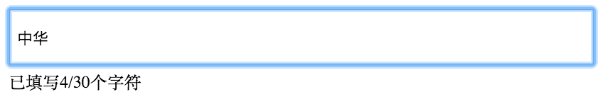

# text-counter

A small jQuery plugin to show counter of text

## Getting started

Install it, using [Bower](http://bower.io/):

```sh
$ bower install text-counter
```

Or using [npm](https://www.npmjs.com/):

```sh
$ npm install --save text-counter
```

Include it:

```html
<script src="//code.jquery.com/jquery-1.11.1.min.js"></script>
<script src="text-counter.js"></script>

<!-- [optional] Include the CSS file to use the plugin default themes and loaders -->
<link href="text-counter.css" rel="stylesheet">
```

Use it:

```javascript
$("#some-element").textCounter({ limit: 30 });
```

Screenshot:


